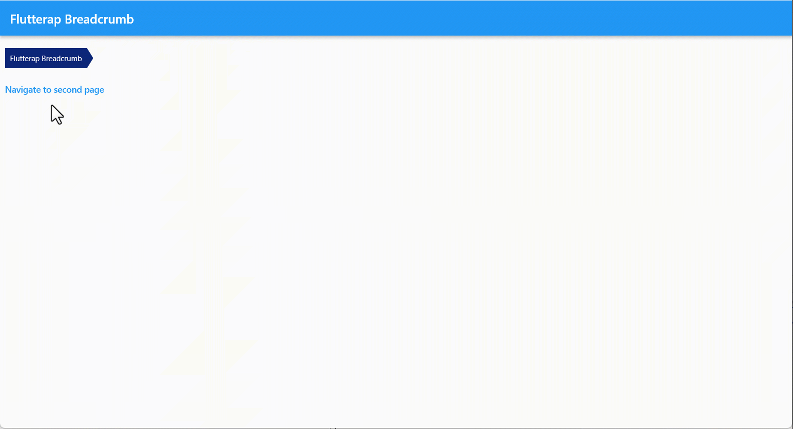
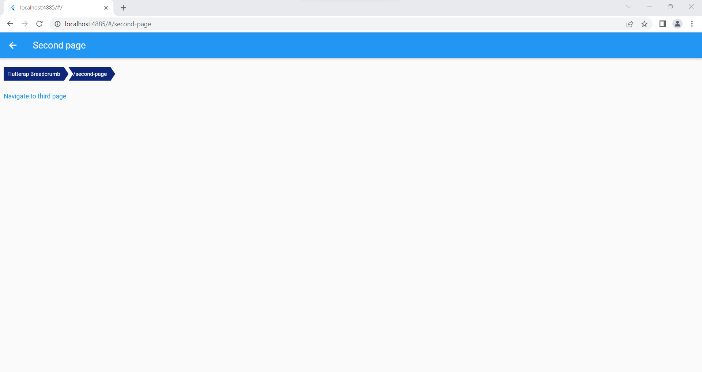
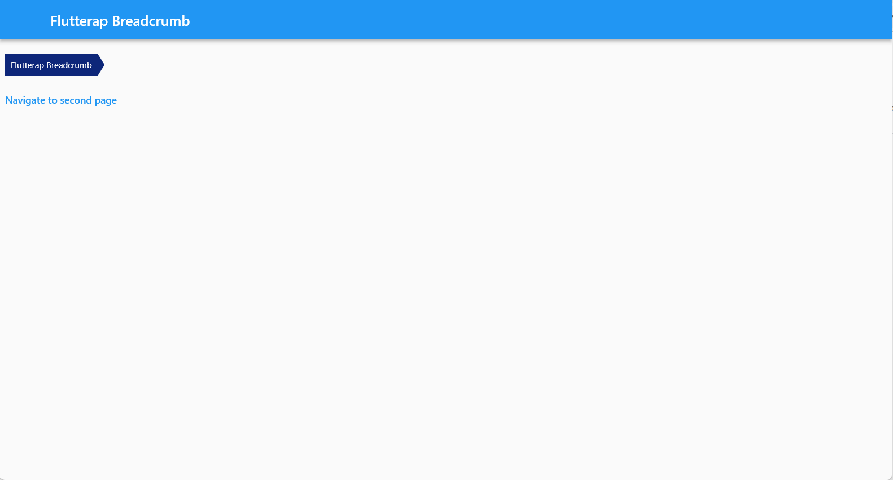

## Flutterap_breadcrumb
This package is extended from flutterap admin panel
Flutterap is a most developer-friendly, highly customizable admin dashboard template based on Flutter.
It comes with lots of features that make development easier for you.
<a href="https://flutterap.com" rel="nofollow">Website : flutterap.com</a>

## Features

Breadcrumb widget based on flutter navigation, with different styles.
Due to the fact that the breadcrumb has a special importance in Flutter programs, especially in the desktop, which does not have a back button, 
Flutterap_breadcrumb is designed based on Navigation system of flutter and uses from AppNavigatorObservers in MaterialApp.
Flutterap_breadcrumb support rtl and ltr locales, and you can manage presence on each page by click on breadcrumb component.
Flutterap_breadcrumb is provided in different styles that the shaped case images in different platforms are shown below.




## Flutterap_breadcrumb in mobile


## Flutterap_breadcrumb in web


## Flutterap_breadcrumb in desktop


## Getting started


First navigatorObservers: [AppNavigatorObserver()], should be added in  main MaterialApp:

MaterialApp(
debugShowCheckedModeBanner: false,
navigatorObservers: [AppNavigatorObserver()],...

## Usage


```dart
class InitialPage extends StatelessWidget {
  const InitialPage({Key? key}) : super(key: key);

  @override
  Widget build(BuildContext context) {
    return Scaffold(
      appBar: AppBar(
        title:  Text("Flutterap Breadcrumb",),
      ),
      body:Column(
        mainAxisAlignment: MainAxisAlignment.start,
        crossAxisAlignment: CrossAxisAlignment.start,
        children: [
          Padding(
            padding: const EdgeInsets.symmetric(horizontal: 8.0,vertical: 20),
            child: FxBreadCrumbNavigator.shaped(
              firstRoute: "Flutterap Breadcrumb",
              breadButtonType: BreadButtonType.shaped,),
          ),

          TextButton(

            onPressed: () {
              Navigator.pushNamed(context, SecondPage.routeName);
            },
            child: const Text('Navigate to second page'),
          ),
        ],
      ),
    );
  }
}

```


