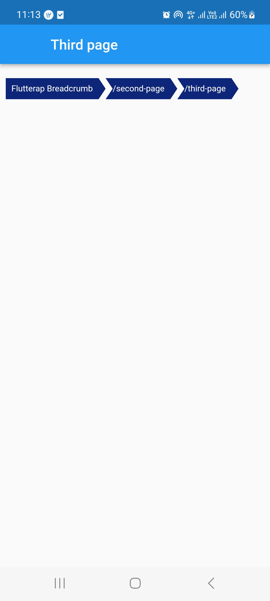

<!--
This README describes the package. If you publish this package to pub.dev,
this README's contents appear on the landing page for your package.

For information about how to write a good package README, see the guide for
[writing package pages](https://dart.dev/guides/libraries/writing-package-pages).

For general information about developing packages, see the Dart guide for
[creating packages](https://dart.dev/guides/libraries/create-library-packages)
and the Flutter guide for
[developing packages and plugins](https://flutter.dev/developing-packages).
-->

Breadcrumb widget based on flutter navigation, with different styles.

## Features


Due to the fact that the board has a special importance in Flutter programs, especially in the desktop, which does not have a back button, 
Flutterap_breadcrumb is designed based on Navigition system of flutter and uses from AppNavigatorObservers in MaterialApp.
Flutterap_breadcrumb support rtl and ltr locales.
Flutterap_breadcrumb is provided in different styles that the shaped case images in defferent platforms are shown below.




## Getting started


First navigatorObservers: [AppNavigatorObserver()], should be added in  main MaterialApp:

MaterialApp(
debugShowCheckedModeBanner: false,
navigatorObservers: [AppNavigatorObserver()],...

## Usage


```dart
class InitialPage extends StatelessWidget {
  const InitialPage({Key? key}) : super(key: key);

  @override
  Widget build(BuildContext context) {
    return Scaffold(
      appBar: AppBar(
        title:  Text("Flutterap Breadcrumb",),
      ),
      body:Column(
        mainAxisAlignment: MainAxisAlignment.start,
        crossAxisAlignment: CrossAxisAlignment.start,
        children: [
          Padding(
            padding: const EdgeInsets.symmetric(horizontal: 8.0,vertical: 20),
            child: FxBreadCrumbNavigator.shaped(
              firstRoute: "Flutterap Breadcrumb",
              breadButtonType: BreadButtonType.shaped,),
          ),

          TextButton(

            onPressed: () {
              Navigator.pushNamed(context, SecondPage.routeName);
            },
            child: const Text('Navigate to second page'),
          ),
        ],
      ),
    );
  }
}

```


